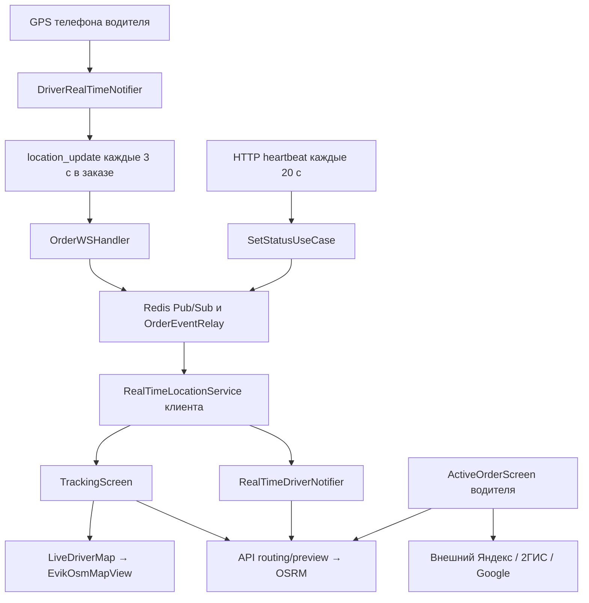

# Аудит трекинга эвакуатора у клиента

Дата: 14 сентября 2026. Объект: текущая рабочая копия EVIK, HEAD `c43553059374cc1b0bf0a623903bc21edda5a02f`, включая существовавшие незакоммиченные изменения. Это аудит и проект исправлений; изменения рабочего кода не вносились, deployment не проверялся.

## Вывод

База для трекинга есть: фоновая геолокация, WebSocket, доставка событий клиенту заказа, OSM-карта, серверный OSRM, анимация маркера. Но требование «водитель и клиент видят один актуальный маршрут» сейчас не выполнено. Есть воспроизведённый дефект доставки небольших перемещений и несколько ошибок протокола, маршрутизации и камеры.

Нужна единая сессия трекинга заказа: актуальная позиция, этап, версия маршрута, его геометрия и ETA. Клиент отображает эту сессию. Самостоятельные расчёты на разных экранах не гарантируют совпадение маршрутов.

## Что проверено

- Код GPS → водительский notifier → WebSocket/HTTP → сервер → Redis Pub/Sub → клиентский экран → карта; отдельно источник маршрута и внешний навигатор.
- GitNexus EVIK переиндексирован через `node .gitnexus/run.cjs analyze --force --index-only`: старый индекс имел несовместимый формат БД. Новый индекс: 11 776 узлов, 34 700 связей, 372 процесса. Индексатор предупреждал об ограничениях обхода процессов и межъязыкового разрешения; отсутствие связи не использовалось как доказательство отсутствия кода.
- `query`, `context(handleLocationUpdate)` и `impact(handleLocationUpdate, upstream)`: LOW, цепочка `Handle → readPump → handleWSMessage → handleLocationUpdate`. Это оценка области изменения по графу, а не низкая важность найденного дефекта. Для остальных будущих правок impact нужно выполнить отдельно.
- 12 выбранных Flutter-тестов прошли. Go-пакеты WebSocket и driver use cases прошли, результат был из кеша; у domain/routing и infrastructure/websocket тестов нет.
- Два дополнительных Go-теста через временный overlay запускают настоящий обработчик с fake repositories и управляемыми часами. Оба выявили сбой. Сетевое соединение, Redis и телефон в этих тестах не участвуют.
- Реальная поездка с двумя устройствами, background/resume, визуальная проверка жестов и нагрузочные измерения в этом аудите не выполнялись.

## Текущая схема



`driverLocation: null` в `LiveDriverMap` не отключает текущий маркер: экран передаёт его через `extraMarkers`. Это убирает панель со скоростью и техническим ID. Обвинять эту строку в пропаже трекинга оснований нет.

## Подтверждённые проблемы

### 1. P1 — WebSocket теряет небольшие перемещения и обновления стоящего водителя

[order_ws_handler.go:233](/Users/rasul/Documents/EVIK/backend/internal/transport/ws/order_ws_handler.go:233): сначала `lastLocationPublish[driver] = now`, затем фильтр расстояния читает это же значение как время последней записи. Поэтому `now.Sub(lastWrite)` практически всегда равно нулю. При перемещении менее 50 м выполняется `return` до публикации клиенту.

Последствия: машина на карте обновляется рывками; на стоянке не приходят изменения фазы с теми же координатами; первый GPS после принятия может быть отфильтрован, если до принятия уже пришла эта позиция. HTTP heartbeat частично маскирует проблему, но не исправляет WebSocket.

Воспроизведено:

| Сценарий | Ожидается | Получено |
|---|---|---|
| Та же точка спустя 31 секунду | Второе событие клиенту | Только первое |
| Перемещение примерно 11 м за 3 секунды | Второе событие клиенту | Только первое |

Исправление: разделить частоту клиентских событий, сохранение последней телеметрии и обновление GEO-индекса для поиска водителей. У каждого свой таймер. Смена заказа/фазы должна публиковаться независимо от расстояния.

### 2. P1 — Фаза движения и направление повреждаются разными форматами событий

[realtime_location_service.dart:150](/Users/rasul/Documents/EVIK/frontend/lib/core/services/realtime_location_service.dart:150) отправляет `status.name`: `toDestination`. Парсер принимает `to_destination`; неизвестное значение превращает в `toPickup`. Сервер пересылает строку без нормализации.

Кроме того, [set_status.go:249](/Users/rasul/Documents/EVIK/backend/internal/usecase/driver/set_status.go:249) публикует HTTP-координаты без статуса, скорости и направления. Клиент подставляет `toPickup`, 0 и 0. Heartbeat может вернуть на экране фазу «едет к погрузке» и развернуть маркер на север, хотя эвакуатор уже везёт автомобиль к месту назначения.

Исправление: один явный wire-format; фаза определяется серверным состоянием заказа. Отсутствующее поле означает «нет нового значения», а не сброс в ноль. Состояние заказа должно обновляться независимо от GPS.

### 3. P1 — Общего маршрута водителя и клиента нет

[tracking_screen.dart:184](/Users/rasul/Documents/EVIK/frontend/lib/features/client/presentation/screens/tracking_screen.dart:184) запрашивает свой preview. [active_order_screen.dart:194](/Users/rasul/Documents/EVIK/frontend/lib/features/driver/presentation/screens/active_order_screen.dart:194) запускает внешний навигатор, передавая пункт назначения. Обратного канала для выбранной там геометрии нет. Даже одинаковый адрес назначения не гарантирует одинаковые дороги, альтернативу или учёт пробок.

На водительском экране GPS берётся один раз. Ключ preview включает заказ, статус и цель, но не координаты водителя. Если preview успевает построиться до GPS, он может остаться построенным от точки погрузки; приход начальной позиции не меняет ключ. При дальнейшем движении маршрут этого экрана не обновляется по GPS.

Исправление: единый маршрут EVIK с `routeVersion`, показанный обоим. Для точного совпадения с водительской навигацией она должна использовать этот маршрут либо передавать свой выбранный маршрут через поддерживаемый SDK. С текущими external deep links обещать совпадение нельзя.

### 4. P1 — Перестроение не определяет съезд с маршрута и допускает гонки

На клиенте условие — более 100 м от точки предыдущего расчёта ИЛИ более 30 секунд, проверяемых только при новом событии. Это не расстояние до линии маршрута. Смена цели/этапа при стоящем водителе может не вызвать пересчёт сразу.

Параллельные запросы не имеют generation/request ID. Более старый медленный ответ может заменить новый. При сетевой ошибке `MapApi` возвращает null, экран очищает линию и обновляет время последнего расчёта, задерживая повторную попытку.

Дополнительно [real_time_driver_provider.dart:208](/Users/rasul/Documents/EVIK/frontend/lib/features/client/presentation/providers/real_time_driver_provider.dart:208) строит ещё один маршрут с порогом 75 м к первоначально переданной точке погрузки. Экран этот результат не использует. Два независимых расчёта увеличивают нагрузку и расходятся по состоянию.

Исправление: один coordinator с проверкой качества GPS, расстояния до подходящего сегмента, подтверждением отклонения несколькими измерениями, ограничением частоты и защитой от запоздавших результатов. Смена этапа или адреса немедленно инвалидирует предыдущую версию.

### 5. P1 — Свежесть и порядок координат не контролируются

[driver_realtime_provider.dart:244](/Users/rasul/Documents/EVIK/frontend/lib/features/driver/presentation/providers/driver_realtime_provider.dart:244) повторно отправляет сохранённую позицию по таймеру. В сообщении нет времени GPS-измерения и accuracy. Сервер не использует исходный timestamp; [realtime_location_service.dart:288](/Users/rasul/Documents/EVIK/frontend/lib/core/services/realtime_location_service.dart:288) назначает входящим серверным координатам `DateTime.now()`.

Последняя известная точка при отказе GPS может выглядеть как свежая. Экран не имеет состояния «координаты устарели» и не отбрасывает старые/повторные события. HTTP fallback также допускает last-known GPS без проверки возраста.

Исправление: передавать `sampledAt`, `receivedAt`, `accuracyM`, session/sequence, nullable bearing/speed; различать доступность соединения и свежесть измерения. При плохом GPS сохранять последнюю точку с понятной пометкой, прекращать прогноз движения и уточнять ETA.

### 6. P1 — Начальный снимок и восстановление трекинга не гарантированы

WebSocket Handle регистрирует соединение, но не отдаёт снимок текущей позиции заказа. Broadcast stream клиента не переигрывает последнюю позицию новому экрану. Поэтому открытие карты после принятия/переподключение ждёт очередного события; фильтр из пункта 1 усиливает задержку.

`connect()` объявляет соединение установленным без ожидания `channel.ready`; повторные вызовы не закрывают прежний канал. Ошибка и закрытие могут независимо запланировать reconnect через 2 секунды. Сохранённый токен используется повторно без процедуры обновления в этом сервисе.

Исправление: владелец одного соединения на сессию, heartbeat/pong watchdog, backoff с jitter, обновление auth, snapshot при подключении и восстановлении, затем упорядоченные события. Snapshot и stream согласовать watermark/sequence, чтобы не потерять событие между ними.

### 7. P2 — Экран обходит фильтр заказа и неполно завершает сессию

[tracking_screen.dart:134](/Users/rasul/Documents/EVIK/frontend/lib/features/client/presentation/screens/tracking_screen.dart:134) принимает все события сервиса, не проверяя `orderId` и назначенного `driverId`. В provider фильтр заказа есть, но карта использует собственную подписку. Это прежде всего риск смешивания событий между сессиями; утверждать утечку координат произвольного чужого водителя нельзя — сервер проверяет назначение водителя.

`dispose()` экрана отменяет только свою подписку, а provider/соединение остаются. `RealTimeDriverState.copyWith` не умеет очищать nullable-поля, хотя `stopTracking()` передаёт null. В WS-публикации нет проверки терминального статуса заказа, только назначения водителя. Эти границы нужно унифицировать и проверить на отмене, завершении и следующем заказе.

### 8. P2 — Камера повторно подгоняется во время анимации

[tracking_screen.dart:62](/Users/rasul/Documents/EVIK/frontend/lib/features/client/presentation/screens/tracking_screen.dart:62) вызывает `setState` всего экрана на каждом кадре. Создаются новые списки маркеров. [evik_osm_map_view.dart:129](/Users/rasul/Documents/EVIK/frontend/lib/features/map/presentation/widgets/evik_osm_map_view.dart:129) сравнивает списки по идентичности и планирует `_fitCamera()`.

Пока `_userInteracted` false, это многократный fit. Кнопки +/− не устанавливают этот флаг; после увеличения карты следующий кадр способен вернуть обзор. Drag, double tap и wheel учтены частично; pinch требует отдельной проверки. Fit включает конечный адрес даже на этапе подачи; padding всего 42 со всех сторон, хотя снизу большая карточка заказа.

Исправление: состояния камеры «обзор подачи», «обзор перевозки», «следование», «ручной просмотр». Любое ручное управление, включая +/−, выключает автоследование. Возврат — явной кнопкой. Fit выполнять на входе/смене этапа/по запросу, с реальными отступами карточек. Анимировать отдельный слой, не весь экран.

### 9. P2 — Маркер не адаптируется к масштабу и срезает повороты

[tracking_screen.dart:409](/Users/rasul/Documents/EVIK/frontend/lib/features/client/presentation/screens/tracking_screen.dart:409): круг 46 logical pixels, иконка 24; слой даёт custom marker контейнер 56×56. Размер не связан с zoom. Это не означает бесконечное увеличение картинки при приближении: размер на экране уже фиксированный. Недостаёт управляемой адаптации под дальний/близкий обзор.

Перемещение линейное между GPS-точками за 3 секунды, без следования геометрии дороги. При частом новом событии старт берётся из предыдущей целевой точки, а не из текущего нарисованного положения: возможен скачок. Боковой силуэт грузовика вращается как курсор; визуально направление неоднозначно.

Предложение: силуэт эвакуатора сверху, носом вверх при bearing=0; плавный ограниченный размер 28–44 logical pixels. Например, `28 + 16 * clamp((zoom - 12) / 6, 0, 1)`. Это стартовая UX-настройка EVIK, а не опубликованный стандарт Uber. Проверить на zoom 10/12/15/18/19, разных DPI и повороте карты. Если карту можно вращать, преобразование bearing должно учитывать её rotation ровно один раз. Положение анимировать вдоль подтверждённого маршрута; не притягивать к дороге при низкой уверенности, на стоянке и во дворе.

### 10. P2 — Preview не учитывает параметры эвакуатора; неверные ответы могут стать прямой линией

[routing/service.go:66](/Users/rasul/Documents/EVIK/backend/internal/domain/routing/service.go:66) использует профиль car. В запросе нет высоты, массы, длины и состояния «с погруженным автомобилем». Обычный автомобильный маршрут не является подтверждением проезда эвакуатора.

[map_api.dart:115](/Users/rasul/Documents/EVIK/frontend/lib/core/services/map_api.dart:115) при пустой геометрии успешного ответа рисует две точки from/to. Это потенциально ложная «дорога» через квартал; ошибка HTTP вместо этого возвращает null. Нужно валидировать геометрию и показывать недоступность маршрута, не выдавая прямую линию за дорожный путь.

Backend по умолчанию использует demo OSRM. Реальное значение production env не проверялось. Перед запуском надёжной навигации нужен проверенный routing-host/provider и покрытие ограничений эвакуаторов в рабочем регионе.

## Что дают открытые материалы крупных сервисов

Это проверка публичных принципов, а не утверждение, что известна закрытая архитектура Яндекс Go или текущая внутренняя реализация Uber.

- **Uber:** GPS в плотной застройке может существенно ошибаться; компания описывает вероятностную обработку GNSS и 3D-карты. Для EVIK практический вывод — сохранять accuracy/время и учитывать неопределённость, не пытаться скрыть плохую геолокацию красивой анимацией. [Uber Engineering](https://www.uber.com/us/en/blog/rethinking-gps/).
- **Яндекс NaviKit:** ведение предоставляет текущий маршрут, позицию и точность; маршрут меняется при отклонении или выборе альтернативы, есть соответствующие listeners. Это модель событий, необходимая EVIK для синхронизации фактически выбранного пути. Это документация SDK, не описание Яндекс Go. [Guidance](https://yandex.com/maps-api/docs/mapkit/android/generated/navigation/guidance.html).
- **Яндекс, грузовая навигация:** VehicleOptions позволяет учитывать габариты и весовые параметры. Для эвакуатора нужно различать пустую подачу и перевозку с автомобилем; достаточность данных о дорогах всё равно проверяется в регионе. [Build routes](https://yandex.com/maps-api/docs/mapkit/android/generated/navigation/routes_building.html).
- **Google Mobility:** публичная схема связывает trip, назначенный vehicle, backend и consumer; клиент получает позицию, маршрут, прогресс и ETA, а сопровождение заканчивается по завершении/отмене. Это хороший образец разделения ответственности для такси и доставки. [Consumer SDK](https://developers.google.com/maps/documentation/mobility/journey-sharing/on-demand).
- **OSRM:** `route` строит путь, `match` сопоставляет последовательность GPS с дорогами и возвращает confidence; не все точки удаётся сопоставить. Роутинг и исправление GPS — разные задачи. [OSRM HTTP API](https://project-osrm.org/docs/v26.4.0/http).
- **Инфраструктура:** demo OSRM ограничивает использование и не гарантирует uptime/latency. Публичные OSM tiles также не имеют SLA; их политика относится именно к tile.openstreetmap.org. В EVIK default tiles сейчас CARTO, поэтому переносить на них эту политику автоматически нельзя; условия выбранного провайдера нужно проверить отдельно. [OSRM demo policy](https://github.com/Project-OSRM/osrm-backend/wiki/Demo-server), [OSMF tile policy](https://operations.osmfoundation.org/policies/tiles/).

OSM — данные карты. Изображения карты, расчёт пути, ведение водителя, телеметрия и синхронизация клиента — отдельные компоненты. Сохранение OSM-карты не мешает построить правильный трекинг.

## Рекомендуемая организация для EVIK

### Один маршрут на заказ

Сервер хранит сессию с orderId, assignedDriverId, orderVersion, phase и routeVersion. Для OSM-варианта серверный routing coordinator строит маршрут один раз на событие, а оба приложения отображают одну опубликованную геометрию. Водитель подтверждает выбранную альтернативу через EVIK. Перестроение публикует новую версию для обоих устройств.

Если водитель продолжает пользоваться отдельным внешним навигатором, линия у клиента должна называться расчётным маршрутом EVIK. Точно повторять выбранную внешним приложением альтернативу текущая интеграция не умеет. Для полного выполнения исходного требования нужна встроенная навигация/поддерживаемая интеграция. Выбор коммерческого SDK вместо OSM-компонентов требует отдельно проверить совместимость, покрытие и условия использования.

### Контракт и поток

Телеметрия: `orderId`, `driverId`, `trackingSessionId`, `seq`, `sampledAt`, `receivedAt`, `lat`, `lng`, `accuracyM`, nullable `bearingDeg`, `speedMps`, `source`. Единицы явно фиксируются. Повторная передача точки не обновляет `sampledAt`.

Маршрут: `routeVersion`, `orderVersion`, `phase`, `target`, `geometry`, `distanceRemainingM`, `durationRemainingS`, `calculatedAt`, `basedOnLocationSeq`, `vehicleProfile`, `reason`. Новая цель/фаза не принимает ответ от старой версии.

На принятие заказа сервер публикует snapshot с последней позицией и её возрастом; если свежей позиции нет, клиент сразу видит «уточняем местоположение». На reconnect/resume — новый snapshot с watermark, затем stream. Дубликаты и старые sequence отбрасываются. Между процессами backend порядок/версия обеспечиваются централизованно, а не локальным счётчиком каждого instance.

Последняя позиция, маршрут и прогресс хранятся отдельно от Pub/Sub: Pub/Sub не заменяет восстановление пропущенных сообщений. События положения можно объединять до самого свежего; смену маршрута/статуса нужно восстанавливать по версии. Доступ только клиенту этого заказа и назначенному водителю; после завершения/отмены подписка и выдача новых координат прекращаются.

### Перестроение и ETA

Стартовые параметры для эксперимента, не обещанные SLA: отправка свежей GPS при движении раз в 2–3 с; heartbeat 10–15 с с сохранением возраста измерения; пометка задержки примерно после 15 с, устаревания после 30 с. Пороги калибруются по замерам связи, GPS и батареи.

Отклонение оценивается от подходящего сегмента маршрута с учётом accuracy, heading, последовательности движения и прогресса. Несколько качественных точек подтверждают съезд; одиночный выброс не запускает новую линию. При плохой точности не следует просто бесконечно расширять порог: показать неопределённость и дождаться надёжной позиции. Смена адреса/этапа действует немедленно.

В полёте один актуальный запрос; устаревшие ответы игнорируются. При ошибке сохраняется последняя подтверждённая линия с пометкой, пока повторный запрос не успешен. ETA рассчитывается по оставшейся дороге; отсутствие данных о пробках обозначается как приблизительная оценка. Нулевой отсчёт ETA сам по себе не переводит заказ в «прибыл».

### Этапы эвакуации

| Этап | Что показывает клиент |
|---|---|
| Принял / едет к клиенту | Эвакуатор → место погрузки, время подачи |
| Прибыл / погрузка | Эвакуатор у клиента, статус погрузки, без ложного ETA подачи |
| Везёт автомобиль | Эвакуатор → место назначения, ETA доставки, профиль с грузом |
| Ожидание оплаты / завершён / отменён | Финальный статус; дальнейший live-доступ закрывается согласно выбранной границе сервиса |

Камера подачи охватывает машину и погрузку; камера перевозки — машину и назначение. Ручной обзор сохраняется при GPS-событиях, новом маршруте и обновлениях карточки. Нужна кнопка «Показать эвакуатор/маршрут». Названия и размеры уточняются визуально на реальных экранах.

## Очерёдность исправлений

1. Доставка координат: раздельные throttles, каноническая фаза, полная телеметрия и порядок событий. Зафиксировать два воспроизведённых сбоя регрессионными тестами.
2. Единая tracking session: initial snapshot, reconnect/auth, фильтрация по заказу, завершение подписки, свежесть. Убрать дублирующее состояние/расчёты клиента.
3. Общий versioned route: цель по этапу, перестроение, защита от гонок, одинаковая версия у водителя и клиента. Определить полноценную встроенную навигацию для строгого совпадения.
4. Карта: камера и safe padding, отдельная анимация маркера, ограниченная адаптация размера, корректное направление и движение по дороге.
5. Эксплуатация: подходящий routing host, профиль эвакуатора, метрики, проверки на устройствах и нагрузке.

Перед каждой группой — impact соответствующих символов; перед коммитом — полный `detect_changes`, без трактовки partial/truncated как успешной проверки.

## Приёмочные сценарии

| Проверка | Критерий |
|---|---|
| Принятие стоящим водителем | Клиент получает snapshot без ожидания перемещения на 50 м |
| Движение 10–20 м, пробка | Клиент получает свежие события с правильной фазой |
| Отправка из WS и HTTP вперемешку | Нет сброса направления/фазы и движения назад |
| Погрузка → перевозка в той же точке | Цель и routeVersion меняются сразу |
| Реальный съезд / GPS-выброс | Съезд перестраивает общую линию; одиночный выброс — нет |
| Два маршрута возвращаются в обратном порядке | Старый ответ не заменяет новый |
| Нет GPS / нет сети | Видны возраст координат и состояние связи; машина не едет выдуманным путём |
| Открытие карты позднее, reconnect, restart | Snapshot восстанавливает актуальную сессию и маршрут |
| Отмена, завершение, следующий заказ | Старые координаты больше не отображаются и не выдаются бывшему клиенту |
| Zoom +/−, pinch, drag, rotate | Ручной масштаб сохраняется; маркер читаем и правильно ориентирован |
| Длинная подача/доставка, маленький экран | Активный участок виден, точки не скрыты карточкой |
| Свёрнутое приложение водителя, экран заблокирован | Отдельная поездка на iOS и Android подтверждает доставку и расход батареи |
| Другой экземпляр backend / переполненная очередь | Snapshot/версии восстанавливают состояние без смешивания маршрутов |
| Габариты пустого/гружёного эвакуатора | Маршрут проверен на характерных ограничениях региона |

Измерять возраст GPS при отображении p50/p95/p99, задержку routeVersion до обоих клиентов, reconnect recovery, долю stale-сессий, число перестроений и запросов на поездку, dropped/coalesced events, frame time и батарею. Цель для пилота: p95 отображения свежей позиции до 5 с при нормальных GPS/сети; это предстоит подтвердить, текущая реализация эту цель не доказала.

## Команды проверки и ограничения

Из `/Users/rasul/Documents/EVIK/frontend`:

```sh
flutter test test/driver_location_tracking_test.dart test/driver_realtime_tracking_test.dart test/driver_location_settings_test.dart test/evik_osm_map_view_location_test.dart test/map_api_test.dart --reporter expanded
```

Результат: 12 passed. В tracking-тестах preview возвращал тестовую HTTP-ошибку 400; эти тесты проверяют упрощённый текстовый harness/provider, не настоящий TrackingScreen, корректный маршрут или жесты карты.

Из `/Users/rasul/Documents/EVIK/backend`:

```sh
go test ./internal/transport/ws ./internal/usecase/driver ./internal/domain/routing ./internal/infrastructure/websocket
go test -overlay /tmp/evik-tracking-audit-20260914/overlay.json ./internal/transport/ws -run TestAudit -count=1 -v
```

Второй запуск: два ожидаемых падения с `got 1 events, want 2`. Overlay находится во временной папке и не меняет исходники репозитория. Перед удалением временных файлов при реализации следует перенести сценарии в постоянные регрессионные тесты. Полные suites, production и физическая поездка не проверены; этот отчёт не является подтверждением готовности к релизу.
